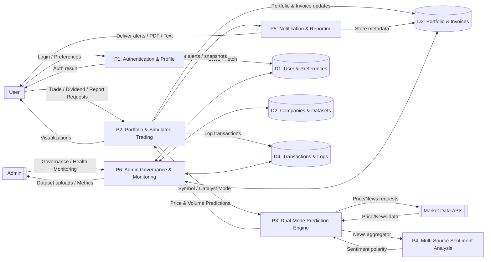

```mermaid
flowchart LR
    %% External Entities
    User[["User"]]
    Admin[["Admin"]]
    MarketData[["Market Data APIs"]]

    %% Processes
    P1["P1: Authentication & Profile"]
    P2["P2: Portfolio & Simulated Trading"]
    P3["P3: Dual-Mode Prediction Engine"]
    P4["P4: Multi-Source Sentiment Analysis"]
    P5["P5: Notification & Reporting"]
    P6["P6: Admin Governance & Monitoring"]

    %% Data Stores
    DS_User[("D1: User & Preferences")]
    DS_Company[("D2: Companies & Datasets")]
    DS_Portfolio[("D3: Portfolio & Invoices")]
    DS_Txn[("D4: Transactions & Logs")]

    %% Flows
    User -->|Login / Preferences| P1
    P1 -->|Store / Fetch| DS_User
    P1 -->|Auth result| User

    User -->|Trade / Dividend / Report Requests| P2
    P2 -->|Portfolio & Invoice updates| DS_Portfolio
    P2 -->|Log transactions| DS_Txn
    P2 -->|Visualizations| User

    P2 -->|Symbol / Catalyst Mode| P3
    P3 -->|Price & Volume Predictions| P2

    P3 -->|Price/News requests| MarketData
    MarketData -->|Price/News data| P3

    P3 -->|News aggregator| P4
    P4 -->|Sentiment polarity| P3

    P2 -->|Trigger alerts / snapshots| P5
    P5 -->|Deliver alerts / PDF / Text| User
    P5 -->|Store metadata| DS_Portfolio

    Admin -->|Governance / Health Monitoring| P6
    P6 -->|Dataset uploads / Metrics| Admin

    P6 <--> DS_User
    P6 <--> DS_Company
    P6 <--> DS_Portfolio
    P6 <--> DS_Txn
```