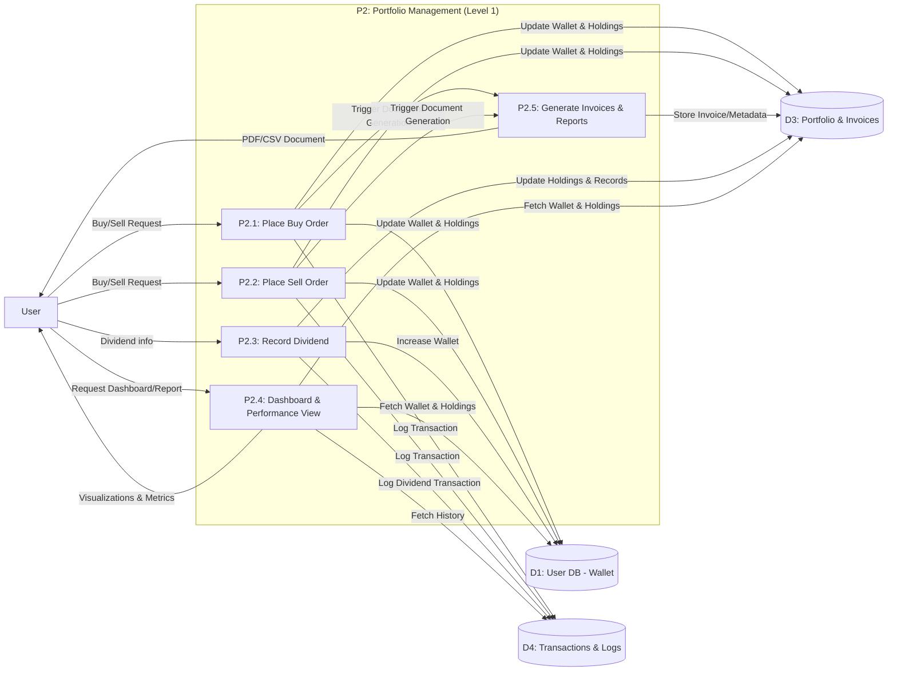

```mermaid
flowchart LR
    User["User"]

    subgraph P2["P2: Portfolio Management (Level 1)"]
        P2_1["P2.1: Place Buy Order"]
        P2_2["P2.2: Place Sell Order"]
        P2_3["P2.3: Record Dividend"]
        P2_4["P2.4: Dashboard & Performance View"]
        P2_5["P2.5: Generate Invoices & Reports"]
    end

    DS_User[(D1: User DB - Wallet)]
    DS_Portfolio[(D3: Portfolio & Invoices)]
    DS_Txn[(D4: Transactions & Logs)]

    %% Trade Flows
    User -->|"Buy/Sell Request"| P2_1 & P2_2
    P2_1 & P2_2 -->|"Update Wallet & Holdings"| DS_User & DS_Portfolio
    P2_1 & P2_2 -->|"Log Transaction"| DS_Txn
    
    %% Invoice/Report Trigger
    P2_1 & P2_2 -->|"Trigger Document Generation"| P2_5
    P2_5 -->|"Store Invoice/Metadata"| DS_Portfolio
    P2_5 -->|"PDF/CSV Document"| User

    %% Dividend Flows
    User -->|"Dividend info"| P2_3
    P2_3 -->|"Increase Wallet"| DS_User
    P2_3 -->|"Update Holdings & Records"| DS_Portfolio
    P2_3 -->|"Log Dividend Transaction"| DS_Txn

    %% Viewing Flows
    User -->|"Request Dashboard/Report"| P2_4
    P2_4 -->|"Fetch Wallet & Holdings"| DS_User & DS_Portfolio
    P2_4 -->|"Fetch History"| DS_Txn
    P2_4 -->|"Visualizations & Metrics"| User
```
