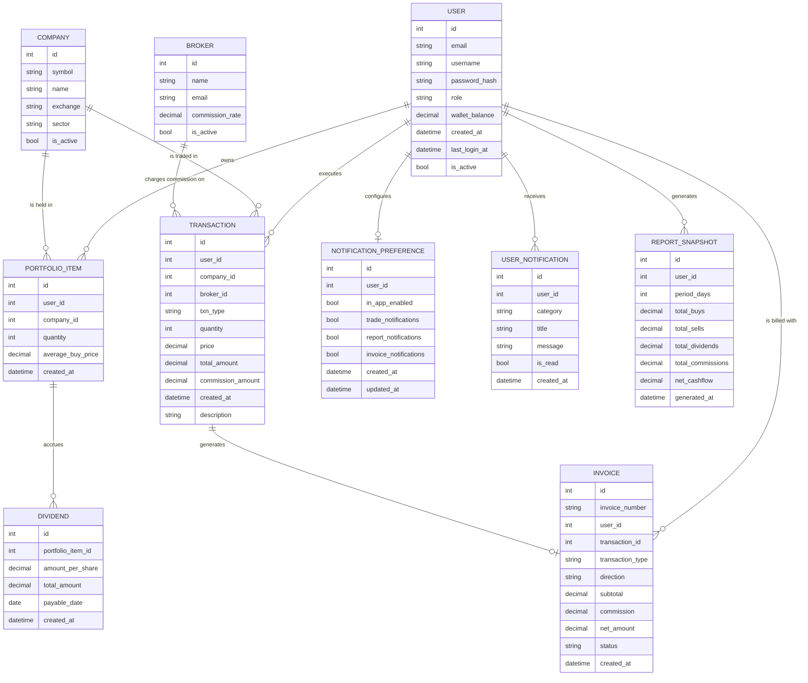

```mermaid
erDiagram
    USER {
        int id
        string email
        string username
        string password_hash
        string role
        decimal wallet_balance
        datetime created_at
        datetime last_login_at
        bool is_active
    }

    COMPANY {
        int id
        string symbol
        string name
        string exchange
        string sector
        bool is_active
    }

    BROKER {
        int id
        string name
        string email
        decimal commission_rate
        bool is_active
    }

    PORTFOLIO_ITEM {
        int id
        int user_id
        int company_id
        int quantity
        decimal average_buy_price
        datetime created_at
    }

    TRANSACTION {
        int id
        int user_id
        int company_id
        int broker_id
        string txn_type
        int quantity
        decimal price
        decimal total_amount
        decimal commission_amount
        datetime created_at
        string description
    }

    DIVIDEND {
        int id
        int portfolio_item_id
        decimal amount_per_share
        decimal total_amount
        date payable_date
        datetime created_at
    }

    NOTIFICATION_PREFERENCE {
        int id
        int user_id
        bool in_app_enabled
        bool trade_notifications
        bool report_notifications
        bool invoice_notifications
        datetime created_at
        datetime updated_at
    }

    USER_NOTIFICATION {
        int id
        int user_id
        string category
        string title
        string message
        bool is_read
        datetime created_at
    }

    REPORT_SNAPSHOT {
        int id
        int user_id
        int period_days
        decimal total_buys
        decimal total_sells
        decimal total_dividends
        decimal total_commissions
        decimal net_cashflow
        datetime generated_at
    }

    INVOICE {
        int id
        string invoice_number
        int user_id
        int transaction_id
        string transaction_type
        string direction
        decimal subtotal
        decimal commission
        decimal net_amount
        string status
        datetime created_at
    }

    USER ||--o{ PORTFOLIO_ITEM : "owns"
    COMPANY ||--o{ PORTFOLIO_ITEM : "is held in"

    USER ||--o{ TRANSACTION : "executes"
    COMPANY ||--o{ TRANSACTION : "is traded in"
    BROKER ||--o{ TRANSACTION : "charges commission on"

    PORTFOLIO_ITEM ||--o{ DIVIDEND : "accrues"

    USER ||--o| NOTIFICATION_PREFERENCE : "configures"
    USER ||--o{ USER_NOTIFICATION : "receives"
    USER ||--o{ REPORT_SNAPSHOT : "generates"
    USER ||--o{ INVOICE : "is billed with"
    TRANSACTION ||--o| INVOICE : "generates"
```