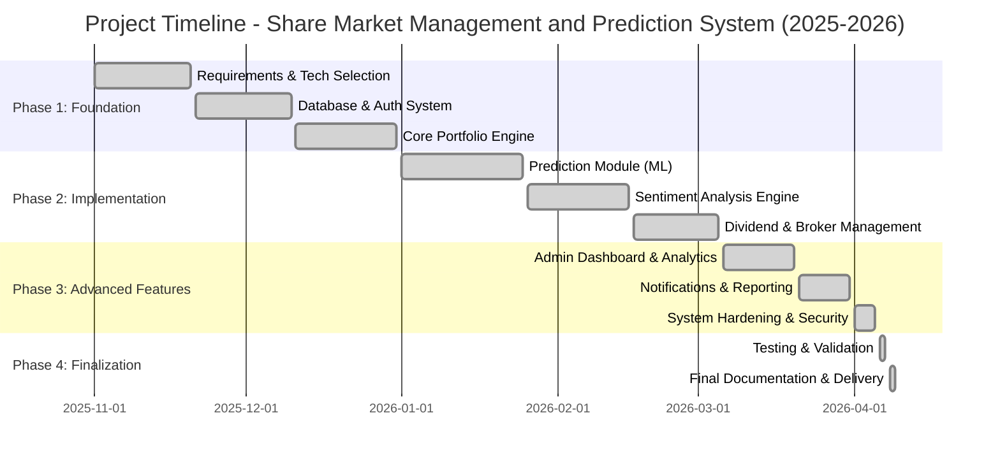

```mermaid
gantt
    dateFormat  YYYY-MM-DD
    title Project Timeline - Share Market Management and Prediction System (2025-2026)

    section Phase 1: Foundation
    Requirements & Tech Selection :done, reqs, 2025-11-01, 2025-11-20
    Database & Auth System        :done, auth, 2025-11-21, 2025-12-10
    Core Portfolio Engine         :done, core, 2025-12-11, 2025-12-31

    section Phase 2: Implementation
    Prediction Module (ML)        :done, impl1, 2026-01-01, 2026-01-25
    Sentiment Analysis Engine     :done, impl2, 2026-01-26, 2026-02-15
    Dividend & Broker Management  :done, impl3, 2026-02-16, 2026-03-05

    section Phase 3: Advanced Features
    Admin Dashboard & Analytics   :done, feat1, 2026-03-06, 2026-03-20
    Notifications & Reporting     :done, feat2, 2026-03-21, 2026-03-31
    System Hardening & Security   :done, feat3, 2026-04-01, 2026-04-05

    section Phase 4: Finalization
    Testing & Validation          :done, test, 2026-04-06, 2026-04-07
    Final Documentation & Delivery :done, doc, 2026-04-08, 2026-04-09
```
