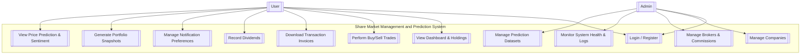

```mermaid
flowchart TB
    %% Actors
    User[["User"]]
    Admin[["Admin"]]

    %% System Functions
    subgraph System["Share Market Management and Prediction System"]
        UC_Login[["Login / Register"]]
        UC_ViewDashboard[["View Dashboard & Holdings"]]
        UC_Trade[["Perform Buy/Sell Trades"]]
        UC_Invoice[["Download Transaction Invoices"]]
        UC_Dividend[["Record Dividends"]]
        UC_Notifications[["Manage Notification Preferences"]]
        UC_Reports[["Generate Portfolio Snapshots"]]
        UC_ViewPrediction[["View Price Prediction & Sentiment"]]
        UC_DatasetManage[["Manage Prediction Datasets"]]
        UC_ManageCompanies[["Manage Companies"]]
        UC_ManageBrokers[["Manage Brokers & Commissions"]]
        UC_Monitor[["Monitor System Health & Logs"]]
    end

    %% Relationships
    User --> UC_Login
    User --> UC_ViewDashboard
    User --> UC_Trade
    User --> UC_Invoice
    User --> UC_Dividend
    User --> UC_Notifications
    User --> UC_Reports
    User --> UC_ViewPrediction

    Admin --> UC_Login
    Admin --> UC_ManageCompanies
    Admin --> UC_ManageBrokers
    Admin --> UC_Monitor
    Admin --> UC_DatasetManage
```